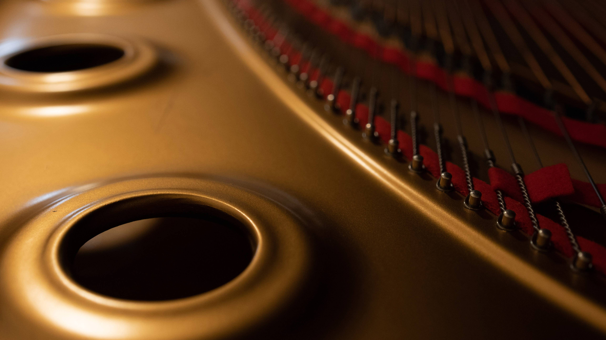
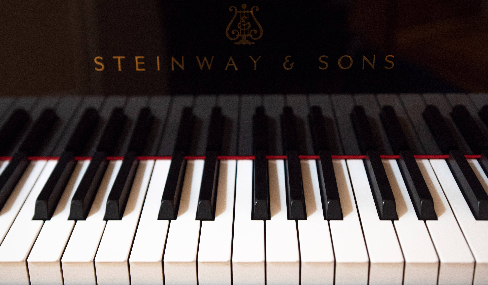

## Welcome to my piano and recording studio.

[Services](#services) | [Pricing](#pricing) | [Equipment](#equipment) | [Gallery](#gallery) | [Booking](#booking)

### Services

High quality video recording up to 4K.

One or two angle shoot.

Multitrack audio recording, up to 192kHz/32 bit.

CD recording, producing and mastering.

The schedule depends on my availability, see my [concerts](https://gryaznoff.com/category/concerts) page.

To get some info about the piano lessons click [piano studio](/piano-studio) page.

Check [giveaway](/giveaway) page to know about free recording sessions for musicians.

### Pricing

#### Audio/video recording

One hour - $75

#### Video for auditions, competitions, YouTube, etc.

Up to one hour of the final video (without audio montage):

One-angle shoot - $250  
Two-angle shoot - $500

#### Audio CD producing and mastering

1 CD - $1000

This option is including 4 hours of recording at studio.

Please use [contact form](#booking) below or [@email](mailto:gryaznov.studio@gmail.com) to book your time or ask a question.

[back to top](#intro)

### Equipment

#### Piano

Concert full grand Steinway D (Hamburg)

#### Cameras

Panasonic GH4 hybrid video/photo camera

Blackmagic Pocket Cinema Camera 4K

#### Audio gear

Presonus AudioBox 18/18  
_multichannel audio interface_

Tascam UH7000  
_two-channel audio interface_

Steinberg UR44C  
_six-channel 32bit audio interface_

Oktava professional condenser microphones (6)

[back to top](#intro)

### Gallery

<!--  -->

<!--  -->

<!--  -->

### Booking

 
<form method="post" name="studio" data-netlify="true" data-netlify-honeypot="bot-field">
<input type="hidden" name="form-name" value="studio" />
<label for="name">Name</label>
 
<input type="text" name="name" id="name" placeholder="Your name here.." required/>
 
 
<label for="email">Email</label>
 
<input type="email" name="email" id="email" placeholder="email@example.com" required/>
 
 
<label for="message"> Message</label>
 
<textarea name="message" id="message" placeholder="your inquiry.." style="height: 150px" required></textarea>
 
 
<button type="submit">Send your message</button>
</form>
