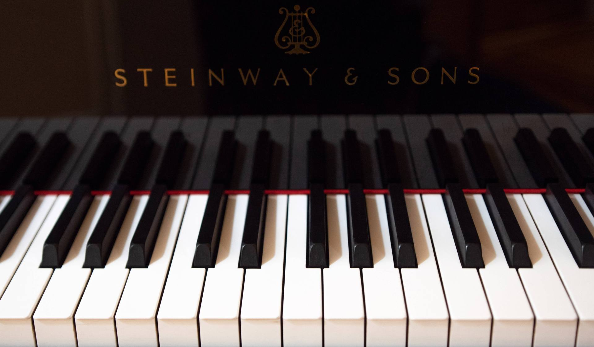

[Services](#services) | [Pricing](#pricing) | [Equipment](#equipment) | [Gallery](#gallery) | [Booking](#booking)

## Services

High quality video recording up to 4K.  
One or two angle shoot.

Multitrack audio recording, up to 96khz / 24 bit.

CD recording, producing and mastering.

I give piano lessons/consultations for professionals who need quick or detailed feedback with the possibility to record the lesson in HQ for your future reference. This optional recording is free of charge.

One hour lesson - $100  
Students - $70

The schedule depends on my availability, see my [concerts](/concerts) page.

---

## Pricing

#### Audio/video recording at studio

One hour - \$75

#### Video for auditions/competitions/YouTube, etc.

Up to one hour of the final video (without audio montage):

One angle shoot - $250  
Two angles shoot - $500

#### Audio CD producing and mastering

1 CD - \$1000

This option is including 4 hours of recording at studio.

Please use [contact form](#booking) below or [@email](mailto:gryaznov.studio@gmail.com) to book your time or ask a question.

[back to top](#intro)

---

## Equipment

#### Piano

Concert full grand Steinway D (Hamburg)

#### Cameras

Panasonic GH4 hybrid video/photo camera  
Blackmagic Pocket Cinema Camera 4K

#### Audio gear

Presonus AudioBox 18/18  
_multichannel audio interface_

Tascam UH7000  
_two-channel audio interface_

Oktava professional condenser microphones (6)

[back to top](#intro)

---

## Gallery

---

## Booking

 
<form method="post" name="contact-studio" data-netlify="true" data-netlify-honeypot="bot-field">
<input type="hidden" name="form-name" value="contact-studio" />
<label for="name">Name</label>
 
<input type="text" name="name" id="name" placeholder="Your name here.." required/>
 
 
<label for="email">Email</label>
 
<input type="email" name="email" id="email" placeholder="email@example.com" required/>
 
 
<label for="message"> Message</label>
 
<textarea name="message" id="message" placeholder="your inquiry.." style="height: 150px" required></textarea>
 
 
<button type="submit">Send your message</button>

[back to top](#intro)

</form>
